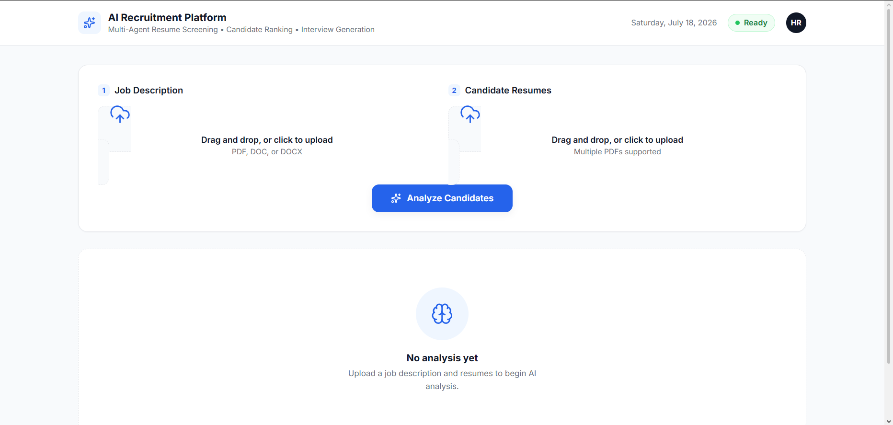
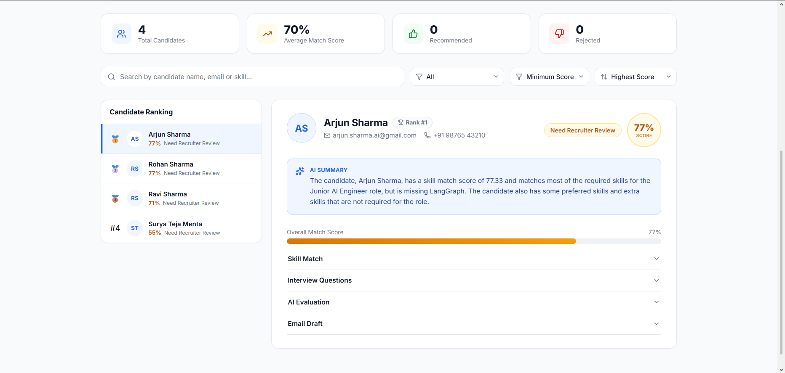
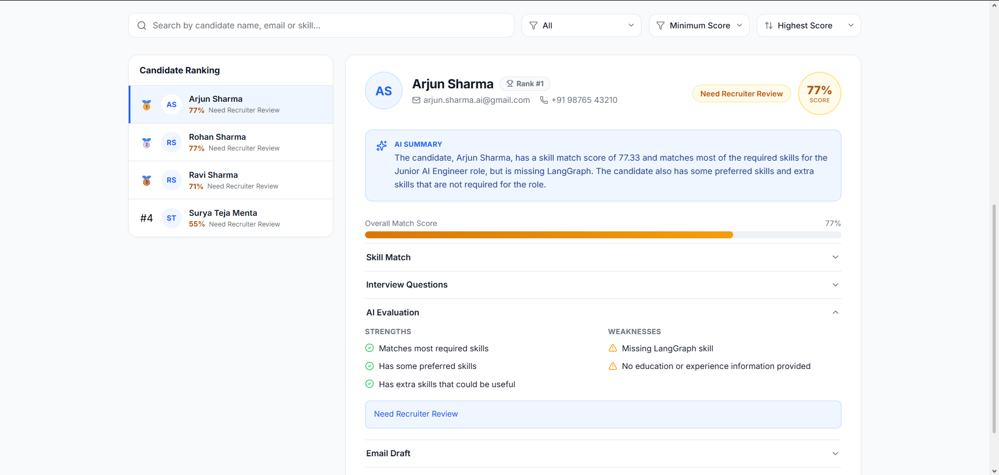
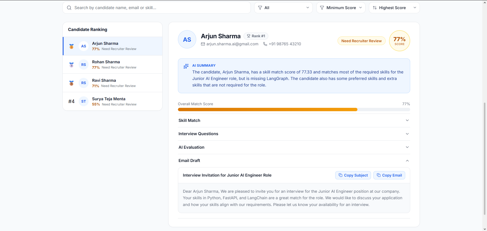

# 🤖 Multi-Agent AI Recruitment Platform

An end-to-end Agentic AI recruitment platform that automates resume screening, candidate evaluation, interview question generation, recruiter email drafting, and candidate ranking using a collaborative multi-agent architecture powered by LangGraph.

---

# 📸 Screenshots

<p align="center">
  
  
  
</p>

<p align="center">
  
  
  
  
</p>


---

# ✨ Features

### 📄 Resume Parsing Agent
- Extracts structured candidate information from PDF resumes.
- Identifies:
  - Name
  - Email
  - Phone
  - Skills
  - Education
  - Experience
  - Projects

---

### 📋 Job Parsing Agent
- Parses Job Description.
- Extracts:
  - Required Skills
  - Preferred Skills
  - Role
  - Experience Requirements

---

### 🎯 Matching Agent
Performs deterministic skill matching.

Generates:

- Overall Match Score
- Required Skills Matched
- Missing Required Skills
- Preferred Skills
- Additional Skills
- Recruiter Recommendation

---

### 💬 Interview Agent

Automatically generates:

- Technical Questions
- Behavioral Questions
- Coding Questions

tailored to each candidate.

---

### 🧠 Explanation Agent

Generates an AI evaluation including:

- Candidate Summary
- Strengths
- Weaknesses
- Hiring Recommendation

---

### ✉ Email Agent

Automatically drafts recruiter emails including:

- Interview Invitation
- Personalized Email Subject
- Professional Email Body

---

### 🏆 Ranking Service

Ranks all candidates based on:

- Skill Match Score
- Recommendation

---

### 🌐 Modern Web Interface

Built with React.

Includes:

- Professional Dashboard
- Candidate Ranking
- Search
- Filter
- Sort
- Skill Visualization
- AI Summary
- Responsive Design

---

# 🏗 Architecture

```

                        React Frontend
                               │
                               ▼
                       FastAPI REST API
                               │
                               ▼
                 Recruitment Workflow (LangGraph)
                               │
      ┌──────────────┬──────────────┬──────────────┐
      ▼              ▼              ▼              ▼
 Resume Agent    Job Agent    Matching Agent  Interview Agent
                                          │
                                          ▼
                               Explanation Agent
                                          │
                                          ▼
                                  Email Agent
                                          │
                                          ▼
                                   Ranking Service
                                          │
                                          ▼
                                  JSON Response
                                          │
                                          ▼
                                 React Dashboard

```

# ⚡ Quick Start

```bash
git clone https://github.com/Kabilan-1616/Multi-agent-ai-recruitment-platform.git

cd Multi-agent-ai-recruitment-platform

python -m venv .venv

.venv\Scripts\activate

pip install -r requirements.txt

uvicorn app.api.server:app --reload
```

Open a second terminal:

```bash
cd frontend

npm install

npm run dev
```

Backend:

```
http://localhost:8000
```

Frontend:

```
http://localhost:5173
```
